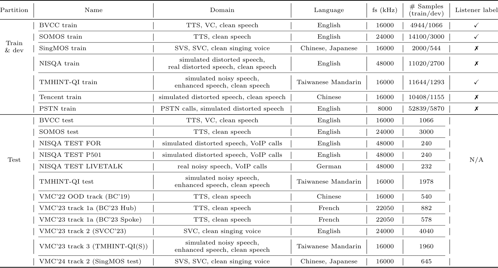

<p align="center">
  
</p>

<h1 align="center">🗣️ SHEET / MOS-Bench 🎧 </h1>
<h3 align="center">Manipulate MOS-Bench with SHEET</h3>

<p>
<b>MOS-Bench</b> is a benchmark designed to benchmark the generalization abilities of subjective speech quality assessment (SSQA) models. <b>SHEET</b> stands for the <b>S</b>peech <b>H</b>uman <b>E</b>valuation <b>E</b>stimation <b>T</b>oolkit. SHEET was designed to conduct research experiments with MOS-Bench.
</p>

<p align="center">
  [](https://arxiv.org/abs/2411.03715)
    <a href="https://huggingface.co/spaces/unilight/sheet-demo"></a>
</p>

## Table of Contents
- [Key Features](#key-features)
- [MOS-Bench Overview](#mos-bench-overview)
- [Supported models and features](#supported-training-datasets)
- [Usage](#usage)
  - [I am new to MOS prediction research. I want to train models!](#i-am-new-to-mos-prediction-research-i-want-to-train-models)
  - [I already have my MOS predictor. I just want to do benchmarking!](#i-already-have-my-mos-predictor-i-just-want-to-do-benchmarking)
  - [I just want to use your trained MOS predictor!](#i-just-want-to-use-your-trained-mos-predictor)
- [Installation](#installation)
- [Information](#information)


## Key Features

- MOS-Bench is the first <b>large-scale collection of training and testing datasets</b> for SSQA, covering a wide range of domains, including synthetic speech from text-to-speech (TTS), voice conversion (VC), singing voice synthetis (SVS) systems, and distorted speech with artificial and real noise, clipping, transmission, reverb, etc. Researchers can use the testing sets to benchmark their SSQA model.
- This repository aims to provide **training recipes**. While there are many off-the-shelf speech quality evaluators like [DNSMOS](https://github.com/microsoft/DNS-Challenge/tree/master/DNSMOS), [SpeechMOS](https://github.com/tarepan/SpeechMOS) and [speechmetrics](https://github.com/aliutkus/speechmetrics), most of them do not provide training recipes, thus are not research-oriented. Newcomers may utilize this repo as a starting point to SSQA research.

## MOS-Bench Overview

MOS-Bench currently contains 7 training sets and 12 test sets. Below is a screenshot of a summary table from our paper. For more details, please see our paper or `egs/README.md`.



## Supported models and features
  <details><summary>Models</summary><div>  
    <ul>
    <li>
      LDNet
      <ul>
        <li>Original repo link: <a href="https://github.com/unilight/LDNet">https://github.com/unilight/LDNet</a></li>
        <li>Paper link: [<a href="https://arxiv.org/abs/2110.09103">arXiv</a>]</li>
        <li>Example config: <code>egs/bvcc/conf/ldnet-ml.yaml</code></li>
      </ul>
    </li>
    <li>
      SSL-MOS
      <ul>
        <li>Original repo link: <a href="https://github.com/nii-yamagishilab/mos-finetune-ssl/tree/main">https://github.com/nii-yamagishilab/mos-finetune-ssl/tree/main</a></li>
        <li>Paper link: [<a href="https://arxiv.org/abs/2110.02635">arXiv</a>]</li>
        <li>Example config: <code>egs/bvcc/conf/ssl-mos-wav2vec2.yaml</code></li>
        <li>Notes: We made some modifications to the original implementation. Please see the paper for more details.</li>
      </ul>
    </li>
    <li>
      UTMOS (Strong learner)
      <ul>
        <li>Original repo link: <a href="https://github.com/sarulab-speech/UTMOS22/tree/master/strong">https://github.com/sarulab-speech/UTMOS22/tree/master/strong</a></li>
        <li>Paper link: [<a href="https://arxiv.org/abs/2204.02152">arXiv</a>]</li>
        <li>Example config: <code>egs/bvcc/conf/utmos-strong.yaml</code></li>
        <li>Notes: After discussion with the first author of UTMOS, Takaaki, we feel that UTMOS = SSL-MOS + listener modeling + contrastive loss + several model arch and training differences. Takaaki also felt that using phoneme and reference is not really helpful for UTMOS strong alone. Therefore we did not implement every component of UTMOS strong. For instance, we did not use domain ID and data augmentation.</li>
      </ul>
    </li>
    <li>
      Modified AlignNet
      <ul>
        <li>Original repo link: <a href="https://github.com/NTIA/alignnet">https://github.com/NTIA/alignnet</a></li>
        <li>Paper link: [<a href="https://arxiv.org/abs/22406.10205">arXiv</a>]</li>
        <li>Example config: <code>egs/bvcc+nisqa+pstn+singmos+somos+tencent+tmhint-qi/conf/alignnet-wav2vec2.yaml</code></li>
      </ul>
    </li>
    </ul>
  </div></details>

  <details><summary>Features</summary><div>
    <ul>
    <li>Modeling<ul>
    <li>Listener modeling</li>
    <li>Self-supervised learning (SSL) based encoder, supported by S3PRL<ul>
    <li>Find the complete list of supported SSL models <a href="https://s3prl.github.io/s3prl/tutorial/upstream_collection.html">here</a>.</li>
    </ul>
    </li>
    </ul>
    </li>
    <li>Training<ul>
    <li>Automatic best-n model saving and early stopiing based on given validation criterion</li>
    <li>Visualization, including predicted score distribution, scatter plot of utterance and system level scores</li>
    <li>Model averaging</li>
    <li>Model ensembling by stacking</li>
    </ul>
    </li>
    </ul>
  </div></details>

## Usage

### I am new to MOS prediction research. I want to train models!

You are in the right place! This is the main purpose of SHEET.

We provide complete experiment recipes, i.e., set of scripts to download and process the dataset, train and evaluate models. This structure originated from Kaldi, and is also used in many speech processing based repositories ([ESPNet](https://github.com/espnet/espnet), [ParallelWaveGAN](https://github.com/kan-bayashi/ParallelWaveGAN), etc.).

Please follow the [installation instructions](#instsallation) first, then see [egs/README.md](egs/) for how to start.

### I already have my MOS predictor. I just want to do benchmarking!

We provide scripts to collect the test sets conveniently. These scripts can be run on Linux-like platforms with basic python requirements, such that you do not need to instal all the heavy packages, like PyTorch.

Please see [the related section in egs/README.md](egs#get-the-test-sets-in-mos-bench) for detailed instructions.

### I just want to use your trained MOS predictor!

We utilize `torch.hub` to provide a convenient way to load pre-trained SSQA models and predict scores of wav files or torch tensors.

```python
# load pre-trained model
>>> predictor = torch.hub.load("unilight/sheet:v0.1.0", "default", trust_repo=True, force_reload=True)

# you can either provide a path to your wav file
>>> predictor.predict(wav_path="/path/to/wav/file.wav")
3.6066928

# or provide a torch tensor with shape [num_samples]
>>> predictor.predict(wav=torch.rand(16000))
1.5806346
```

Or you can try out our HuggingFace Spaces Demo!
<a href="https://huggingface.co/spaces/unilight/sheet-demo"></a>

## Instsallation 

### Editable installation with virtualenv 

You don't need to prepare an environment (using conda, etc.) first. The following commands will automatically construct a virtual environment in `tools/`. When you run the recipes, the scripts will automatically activate the virtual environment.

```bash
git clone https://github.com/unilight/sheet.git
cd sheet/tools
make
```

## Information

### Citation

If you use the training scripts, benchmarking scripts or pre-trained models from this project, please consider citing the following paper.

```
@article{huang2024,
      title={MOS-Bench: Benchmarking Generalization Abilities of Subjective Speech Quality Assessment Models}, 
      author={Wen-Chin Huang and Erica Cooper and Tomoki Toda},
      year={2024},
      eprint={2411.03715},
      archivePrefix={arXiv},
      primaryClass={cs.SD},
      url={https://arxiv.org/abs/2411.03715}, 
}
```

### Acknowledgements

This repo is greatly inspired by the following repos. Or I should say, many code snippets are directly taken from part of the following repos.

- [ESPNet](https://github.com/espnet/espnet)
- [ParallelWaveGAN](https://github.com/kan-bayashi/ParallelWaveGAN/)

### Author

Wen-Chin Huang  
Toda Labotorary, Nagoya University  
E-mail: wen.chinhuang@g.sp.m.is.nagoya-u.ac.jp
